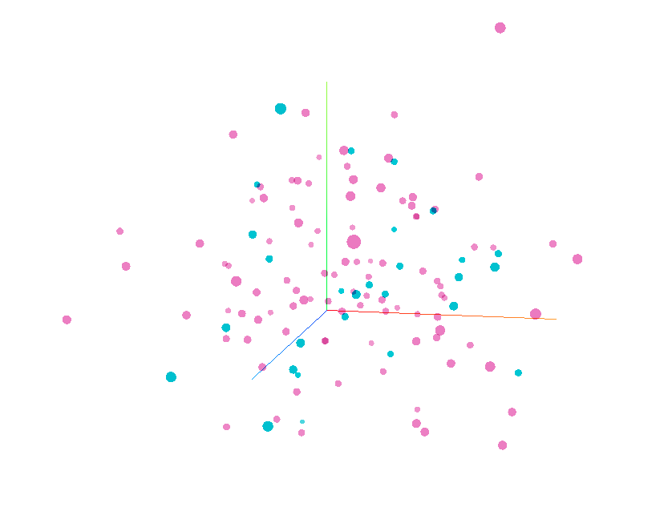
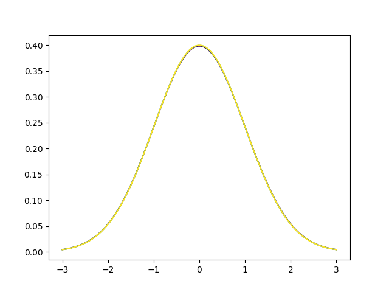
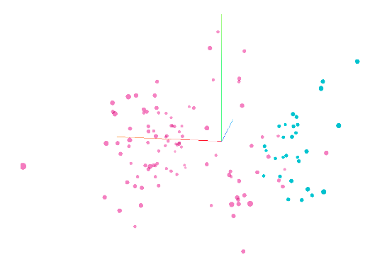
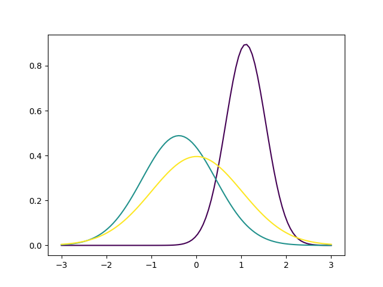

## VAE

VAE is a generative model. Unlike vanilla autoencoders, it has an additional kullback leibler divergence term in its loss function. The idea behind it is that in vanilla autoencoder, the latent space has basically no structure at all. This means gaps between sample points in the latent space often generates useless information with the decoder. In the VAE case, the latent space is optimised to have similar distributions as standard normal distribution with the kullback leibler divergence term. This adds structure in the latent space, and the gaps between two points will be meaningful.

## Implementation Details
In practice VAE is hard to optimize. The result of using stardard binary_crossentropy reconstruction error and kl divergence shows:

This was due to reconstruction error being too small compared to kl divergence, thus the optimizer is only reducing kl divergence, which makes both classes have similar distribution.

We can also visualize the dimensions of a particular sample as follows:

And all three dimension have exactly the same distribution, which is not useful.

In order to make the model focus on reconstruction error more, the reconstruction error is multiplied by a particular number. For a value of 48, which is the input dimension, the clustering performance is increased significantly:

and the corresponding latent dimensions:

## Latent Dimension Representation
One useful thing to know is the what each dimensions of the latent represent. We would like to know how changes in the input would affect the latent dimensions individually. In pseudo-mathematical form, we have f(input)=latent f_inv(latent)=input\', we want to know what changes in input would lead to a positive/negative increase in a specific latent dimension on the encoder side, as well as effect of increasing a particular dimension on the output on the decoder side.

The effect of changing each input with respect to each latent dimensions can be found rather easily, as it is very similar to JSMA's forward derivative generation.

For the decoder side, we can simply change each dimension slightly and observe the output, AKA gradient from first principle: f(x1+theta,x2,x3)/theta for x1,x2 and x3.

The gradients shows inter dependencies between each dimension, 
