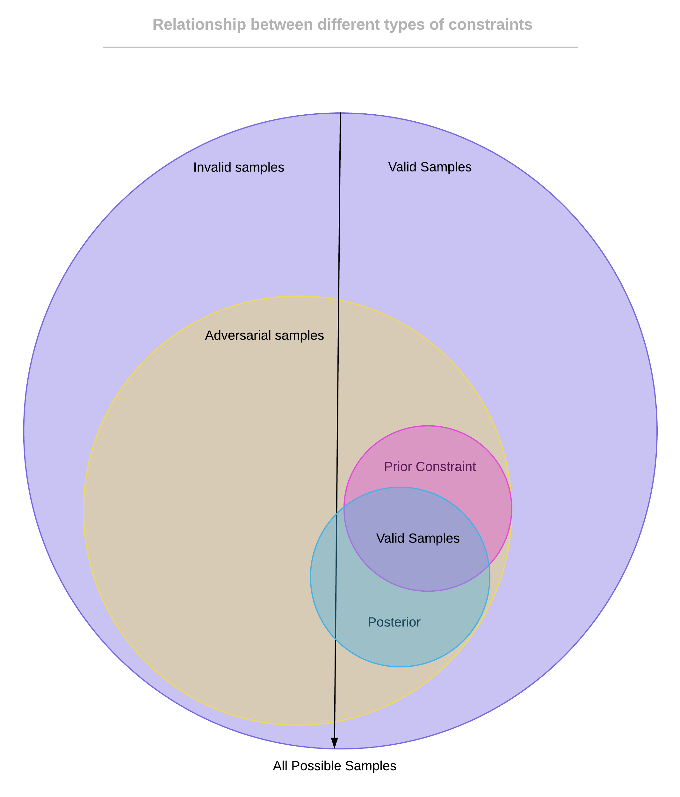

## Adversarial Generation

To generate adversarial samples we have chosen to use JSMA method. JSMA relies on saliency maps to perturb the feature that contributes most towards a particular class. The original implementation of saliency maps only increase or decrease features. Our implementation is a modification of the original implementation that compares the saliency map of increase and decrease feature and picks the maximum value out of the two. It does come with some consequences: there will be a particular sample with particular theta value that will oscillate between increasing and decreasing a set of features, causing the sample to never reach the end.

### Constraints

It is important to have constraints in our adversarial generation. In our framework we consider 2 different types of constraints: prior and posterior constraints.

#### Prior constraints

Prior constraints are constraints that are placed during adversarial generation (e.g. forcing particular column to not change). They can represent different goals of the attacker, and thus we define two prior constraints: strict and loose.

##### Strict prior constraints

Strict prior constraints describe the key characteristics of a class that makes the adversarial attack, and perturbing such feature makes the adversarial sample impossible to be produced or the produced sample would no longer be the attack (e.g. changing protol for most DoS attacks). The goal of the attacker using this constraint would be to bypass the classifier with a particular attack (e.g. slowloris).

##### Loose prior constraints

Loose prior constraints only forces fields to be in a valid range, for example the payload cannot exceed 1500 (the MTU) bytes. This means the adversarial sample could be perturbed to become a different attack. The goal of the attacker in this case would be to bypass the classifier with any attack.

#### Posterior constraints

Posterior constraints are placed after an adversarial sample has been generated. It describes the ability of the attacker to modify the sample. As an example, if the JSMA algorithm shows altering payload length can bypass the classifier, but the attacker is a script-kiddy and does not know how to do so, the adversarial sample is unlikely to be useful. Another examples is different frameworks have different levels of customization of the same attack, so depending on the level of customization the posterior contraints will differ.

Prior constraints are fixed for each type of attack, and can be reused, while posterior constraints depend on each individual/framework. The overall constraint is made as an intersection of the two constraints. The relationship between the contraints and adversarial samples are shown:

### Constrained sample creation

The unconstrained sample creation shows various flag counts and subflow packet length can be modified to create adversarial sample. However such features specified by protocol is hard to have specific control. Thus a constrained creation was done that fixes all features containing flags and subflow.

A sample of constrained perturbation gives us an idea of which features to change, after fixing all flags and subflow features, the perturbations tells us to reduce the minimum packet forward length, increase minimum forward packet size by ~50 and down/up ratio by 1. Thus an adversarial program was modified so that the keep alive packets are now x-a: {random_integer} to x-alalalala: {random_integer}. The new output is able to bypass our classifier.

### CIC FlowMeter

An interesting discovery was that the GUI interface of CIC flow meter outputs different number of flows from the same pcap file. The number of flows generated was different even if you have the same pcap file and generate multiple times. In our case the adversarial file flows range from 150 to ~400. The good news was the command line interface has the same output. However when checking number of packets, the total number of forward and backward packets in the flow does not match the number of packets in cfm output(it is less than the number of valid packets).

Although our adversarial sample is able to bypass the classification network, it would be interesting to see if our modification actually made the traffic towards the adversarial samples.
